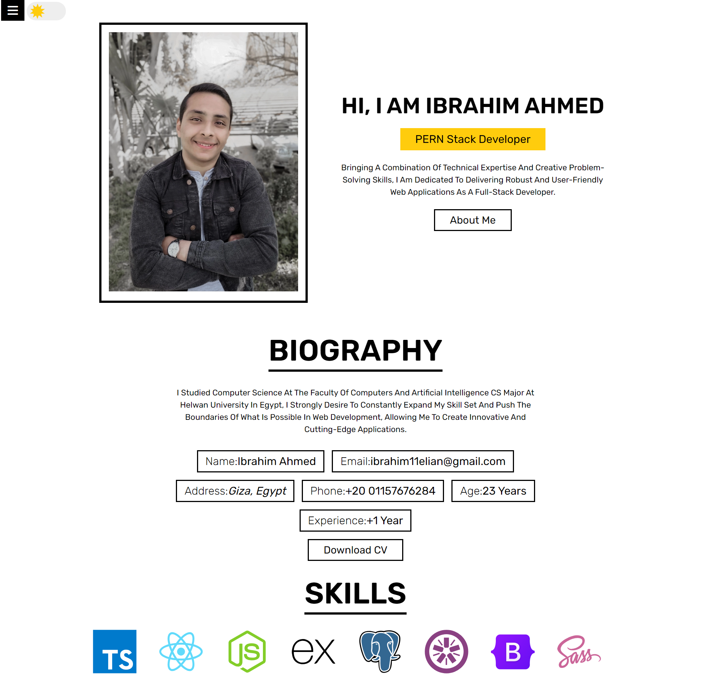

# Ibrahim Ahmed's Portfolio

Welcome to the GitHub repository for my personal portfolio site. This repository contains the source code and assets for my portfolio, showcasing my work, skills, and achievements.

## Table of Contents

- [About](#about)
- [Features](#features)
- [Technologies Used](#technologies-used)
- [Getting Started](#getting-started)
- [Usage](#usage)
- [Screenshots](#screenshots)
- [Contact](#contact)

## About

This portfolio site serves as an online showcase of my projects, skills, and experiences. It is designed to provide visitors with insights into who I am as a professional and highlight my contributions to various projects.

## Features

- **Project Showcase**: Display a curated selection of my projects with descriptions and links.
- **Skills Section**: Highlight key skills and technologies I am proficient in.
- **About Me**: Provide a brief overview of my background, interests, and goals.
- **Contact Form**: Allow visitors to reach out to me easily through a contact form.
- **Responsive Design**: Ensure a seamless experience across various devices and screen sizes.

## Technologies Used

- HTML5
- CSS3
- JavaScript
- [React.js](https://reactjs.org/)

## Getting Started

To get a copy of the project up and running on your local machine, follow these steps:

1. Clone the repository: `git clone https://github.com/ibrahim11elian/My-Portfolio.git`
2. Open the project folder: `cd your-portfolio`
3. `npm start` to run the app in the development mode.\
    Open [http://localhost:3000](http://localhost:3000) to view it in your browser.  
    **Don't forget to check package.json to see the other scripts.**

## Usage

Feel free to explore the site, check out my projects, and get in touch using the provided contact form. If you find any issues or have suggestions for improvement, please create an issue or submit a pull request.

## Screenshots

## Contact

 

- Frontend Mentor - [@ibrahim11elian](https://www.frontendmentor.io/profile/ibrahim11elian)